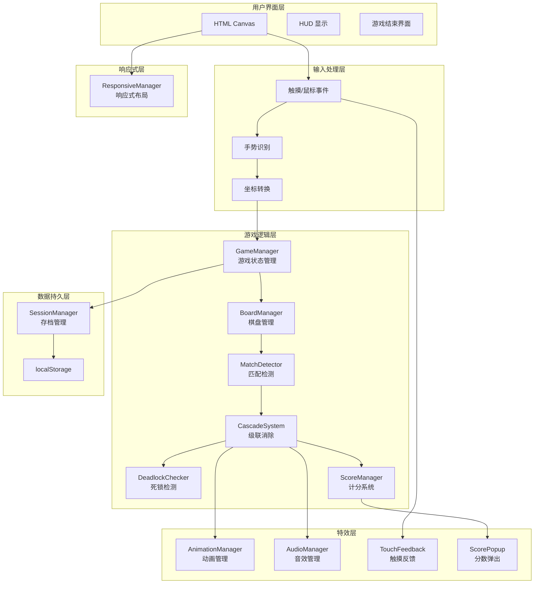
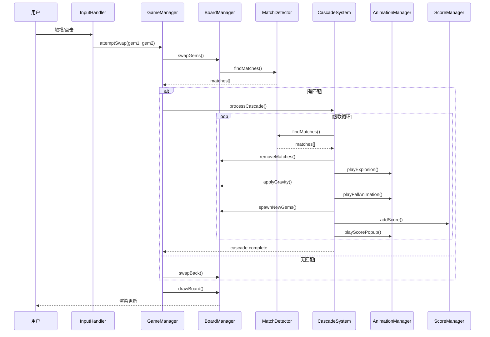
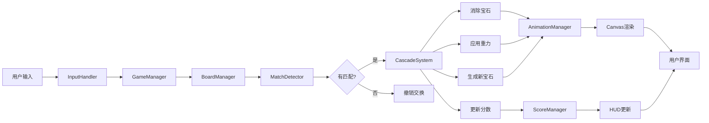
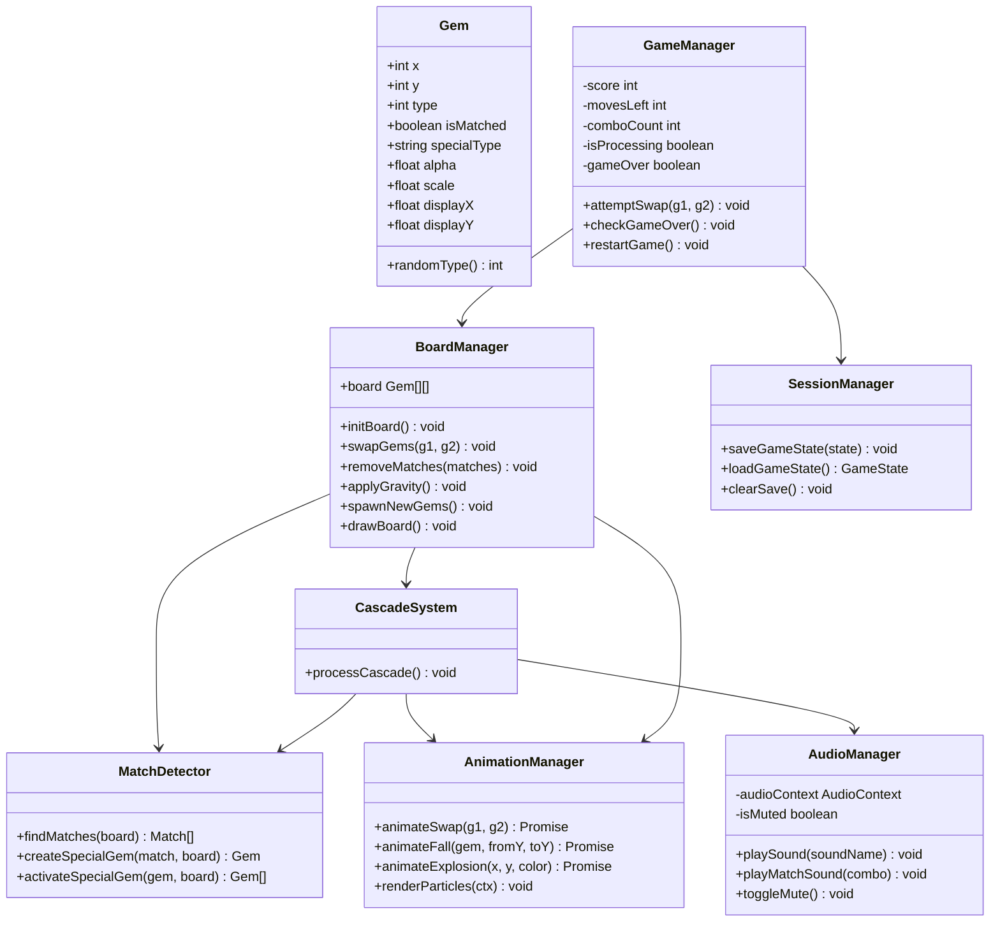

# Matrix Match-3 架构图

## 系统架构



## 核心模块关系



## 数据流



## 类结构



## 文件结构

```
matrix/
├── demo.html                 # 主游戏文件
├── audio-system.js           # 音效系统
├── animation-system.js       # 动画系统
├── responsive-layout.js      # 响应式布局
├── session-persistence.js    # 存档系统
├── demo-README.md            # 用户指南
├── BROWSER_TEST.md           # 浏览器测试清单
├── MOBILE_TEST.md            # 移动端测试清单
├── ARCHITECTURE.md           # 架构图（本文件）
├── DEVELOPMENT_PLAN.md       # 开发计划
├── DEMO_GAPS.md              # 差距分析
├── AGENTS.md                 # 项目规范
└── README.md                 # 项目说明
```

## 技术栈

- **前端框架**: 纯 HTML5 + Canvas
- **编程语言**: JavaScript (ES6+)
- **渲染**: Canvas 2D API
- **动画**: requestAnimationFrame
- **音效**: Web Audio API
- **存储**: localStorage
- **构建**: 无需构建工具，直接运行

## 设计原则

1. **模块化**: 每个功能独立模块，职责单一
2. **可测试**: 核心逻辑与渲染分离
3. **可扩展**: 易于添加新功能和特殊宝石
4. **性能优先**: 使用对象池、批量处理
5. **用户体验**: 流畅动画、即时反馈

---

**文档版本**: 1.0  
**最后更新**: 2026-06-11
